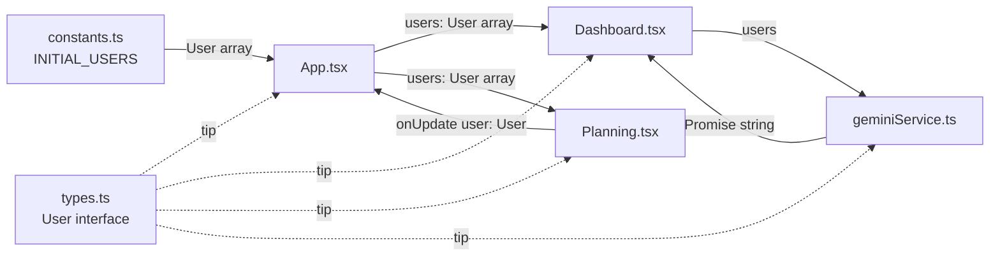

# 🔌 API e Tipos - holidayGo

Documentação completa de tipos TypeScript, interfaces e serviços da aplicação holidayGo.

## Índice

- [Tipos e Interfaces](#tipos-e-interfaces)
  - [User](#user)
  - [UserStatus](#userstatus)
  - [SummaryData](#summarydata)
- [Constantes](#constantes)
  - [INITIAL_USERS](#initial_users)
- [Serviços](#serviços)
  - [geminiService](#geminiservice)
- [Props de Componentes](#props-de-componentes)
- [Utilitários TypeScript](#utilitários-typescript)

---

## Tipos e Interfaces

### User

**Arquivo**: `types.ts`

Interface principal que representa um colaborador no sistema.

```typescript
export interface User {
  id: string;
  name: string;
  email: string;
  role: string;
  department: string;
  hireDate: string;
  status: UserStatus;
  avatar?: string;
  vacationBalance: number;
  vacationUsed: number;
  lastAccess?: string;
  plannedVacations: number[];
}
```

#### Propriedades

| Campo | Tipo | Obrigatório | Descrição |
|-------|------|-------------|-----------|
| `id` | `string` | ✅ | Identificador único do usuário |
| `name` | `string` | ✅ | Nome completo do colaborador |
| `email` | `string` | ✅ | Email corporativo |
| `role` | `string` | ✅ | Cargo/função (ex: "Desenvolvedor Senior") |
| `department` | `string` | ✅ | Departamento (ex: "Tecnologia") |
| `hireDate` | `string` | ✅ | Data de admissão (formato: "YYYY-MM-DD") |
| `status` | `UserStatus` | ✅ | Status atual do colaborador |
| `avatar` | `string` | ❌ | URL da imagem de avatar |
| `vacationBalance` | `number` | ✅ | Dias de férias disponíveis |
| `vacationUsed` | `number` | ✅ | Dias de férias já utilizados/agendados |
| `lastAccess` | `string` | ❌ | Último acesso ao sistema (ex: "Hoje, 09:30") |
| `plannedVacations` | `number[]` | ✅ | Array com dias do mês em férias (ex: [5, 6, 7]) |

#### Exemplo de Uso

```typescript
const user: User = {
  id: '1',
  name: 'Allan',
  email: 'allan@holidaygo.com',
  role: 'Desenvolvedor Senior',
  department: 'Tecnologia',
  hireDate: '2021-05-10',
  status: 'Ativo',
  vacationBalance: 65,
  vacationUsed: 4,
  lastAccess: 'Hoje, 09:30',
  plannedVacations: [5, 6, 7, 8, 9]
};
```

#### Validações Recomendadas

```typescript
// Validar email
const isValidEmail = (email: string): boolean => {
  return email.includes('@') && email.includes('.');
};

// Validar saldo não negativo
const isValidBalance = (balance: number): boolean => {
  return balance >= 0;
};

// Validar data de admissão
const isValidHireDate = (date: string): boolean => {
  const parsed = new Date(date);
  return !isNaN(parsed.getTime()) && parsed <= new Date();
};
```

---

### UserStatus

**Arquivo**: `types.ts`

Tipo union que representa os possíveis status de um colaborador.

```typescript
export type UserStatus = 'Ativo' | 'Inativo' | 'Férias' | 'Pendente';
```

#### Valores Possíveis

| Valor | Descrição | Cor Típica |
|-------|-----------|------------|
| `'Ativo'` | Colaborador trabalhando normalmente | Verde |
| `'Inativo'` | Colaborador desligado ou afastado | Cinza |
| `'Férias'` | Colaborador atualmente em férias | Azul (primary) |
| `'Pendente'` | Status temporário (ex: aguardando aprovação) | Amarelo |

#### Exemplo de Uso

```typescript
// Atribuição
const status: UserStatus = 'Ativo';

// Type guard
const isActive = (status: UserStatus): boolean => {
  return status === 'Ativo';
};

// Switch case
const getStatusColor = (status: UserStatus): string => {
  switch (status) {
    case 'Ativo':
      return 'green';
    case 'Inativo':
      return 'gray';
    case 'Férias':
      return 'blue';
    case 'Pendente':
      return 'yellow';
  }
};

// Mapeamento
const statusColors: Record<UserStatus, string> = {
  'Ativo': 'bg-green-100 text-green-700',
  'Inativo': 'bg-slate-100 text-slate-700',
  'Férias': 'bg-primary/10 text-primary',
  'Pendente': 'bg-yellow-100 text-yellow-700'
};
```

#### Type Safety

```typescript
// ✅ Válido
const status: UserStatus = 'Ativo';

// ❌ Erro de compilação TypeScript
const invalidStatus: UserStatus = 'Trabalhando'; // Type error!
```

---

### SummaryData

**Arquivo**: `types.ts`

Interface para dados de resumo de saldos (uso futuro).

```typescript
export interface SummaryData {
  name: string;
  scheduled: number;
  remaining: number;
  status: 'Normal' | 'Crítico' | 'Bom' | 'Atenção';
}
```

#### Propriedades

| Campo | Tipo | Descrição |
|-------|------|-----------|
| `name` | `string` | Nome do colaborador |
| `scheduled` | `number` | Dias de férias já agendados |
| `remaining` | `number` | Dias de férias restantes |
| `status` | `'Normal' \| 'Crítico' \| 'Bom' \| 'Atenção'` | Status do saldo |

#### Status Logic

```typescript
const calculateStatus = (remaining: number): SummaryData['status'] => {
  if (remaining >= 45) return 'Crítico';
  if (remaining >= 30) return 'Atenção';
  if (remaining >= 15) return 'Normal';
  return 'Bom';
};
```

#### Exemplo de Uso

```typescript
const summaryData: SummaryData = {
  name: 'Allan',
  scheduled: 4,
  remaining: 65,
  status: 'Crítico'
};
```

---

## Constantes

### INITIAL_USERS

**Arquivo**: `constants.ts`

Array de usuários mockados para inicializar a aplicação.

```typescript
export const INITIAL_USERS: User[] = [
  {
    id: '1',
    name: 'Allan',
    email: 'allan@holidaygo.com',
    role: 'Desenvolvedor Senior',
    department: 'Tecnologia',
    hireDate: '2021-05-10',
    status: 'Ativo',
    vacationBalance: 65,
    vacationUsed: 4,
    lastAccess: 'Hoje, 09:30',
    plannedVacations: [5, 6, 7, 8, 9]
  },
  {
    id: '2',
    name: 'Aline Ribeiro',
    email: 'aline@holidaygo.com',
    role: 'Gerente de Projetos',
    department: 'Produto & Design',
    hireDate: '2020-11-15',
    status: 'Ativo',
    vacationBalance: 12,
    vacationUsed: 10,
    lastAccess: 'Ontem, 18:00',
    avatar: 'https://picsum.photos/id/64/100/100',
    plannedVacations: []
  },
  {
    id: '3',
    name: 'Alexandre',
    email: 'alexandre@holidaygo.com',
    role: 'QA Analyst',
    department: 'Tecnologia',
    hireDate: '2022-01-20',
    status: 'Férias',
    vacationBalance: 20,
    vacationUsed: 15,
    lastAccess: '3 dias atrás',
    plannedVacations: [10, 11, 12, 13, 14]
  },
  // ... mais 4 usuários
];
```

#### Características

- **Total**: 7 usuários mockados
- **Departamentos**: Tecnologia, Produto & Design
- **Variação**: Status diferentes, saldos variados
- **Planejamento**: Alguns com férias agendadas, outros não

#### Uso no App

```typescript
// App.tsx
const [users, setUsers] = useState<User[]>(INITIAL_USERS);
```

#### Substituir por API Real

No futuro, substituir por:

```typescript
const [users, setUsers] = useState<User[]>([]);
const [loading, setLoading] = useState(true);

useEffect(() => {
  const fetchUsers = async () => {
    const response = await fetch('/api/users');
    const data = await response.json();
    setUsers(data);
    setLoading(false);
  };
  
  fetchUsers();
}, []);
```

---

## Serviços

### geminiService

**Arquivo**: `geminiService.ts`

Serviço de integração com Google Gemini AI para gerar resumos inteligentes.

#### Função Principal

```typescript
export const generateTeamSummary = async (users: User[]): Promise<string>
```

Gera um resumo executivo em português sobre o status de férias da equipe.

#### Parâmetros

| Parâmetro | Tipo | Descrição |
|-----------|------|-----------|
| `users` | `User[]` | Array de colaboradores a analisar |

#### Retorno

| Tipo | Descrição |
|------|-----------|
| `Promise<string>` | Texto do resumo gerado pela IA |

#### Implementação Completa

```typescript
import { GoogleGenAI } from "@google/genai";
import { User } from "./types";

export const generateTeamSummary = async (users: User[]): Promise<string> => {
  // Inicializa cliente Gemini
  const ai = new GoogleGenAI({ 
    apiKey: process.env.API_KEY || "" 
  });
  
  // Formata contexto da equipe
  const teamContext = users.map(u => 
    `- ${u.name} (${u.role}): Status ${u.status}, Férias este mês: ${
      u.plannedVacations.length > 0 
        ? u.plannedVacations.join(',') 
        : 'Nenhuma'
    }`
  ).join('\n');

  // Constrói prompt estruturado
  const prompt = `
    Abaixo está uma lista da equipe e seus status de férias. 
    Gere um resumo executivo curto (máximo 150 palavras) em Português do Brasil para o gestor de RH.
    Destaque quem está de férias e se há algum risco de sobrecarga ou muitos usuários ausentes.
    
    Equipe:
    ${teamContext}
  `;

  try {
    // Chama API Gemini
    const response = await ai.models.generateContent({
      model: 'gemini-3-flash-preview',
      contents: prompt,
    });
    
    return response.text || "Não foi possível gerar o resumo no momento.";
  } catch (error) {
    console.error("Gemini Error:", error);
    return "Erro ao conectar com a IA para gerar o resumo.";
  }
};
```

#### Exemplo de Uso

```typescript
// Em Dashboard.tsx
const handleGetAiSummary = async () => {
  setIsLoadingSummary(true);
  
  const summary = await generateTeamSummary(users);
  
  setAiSummary(summary);
  setIsLoadingSummary(false);
};
```

#### Formato do Contexto

Para o array de usuários, o contexto gerado seria:

```
- Allan (Desenvolvedor Senior): Status Ativo, Férias este mês: 5,6,7,8,9
- Aline Ribeiro (Gerente de Projetos): Status Ativo, Férias este mês: Nenhuma
- Alexandre (QA Analyst): Status Férias, Férias este mês: 10,11,12,13,14
...
```

#### Exemplo de Resposta da IA

```
"A equipe está em boa condição operacional. Allan está programado para 5 dias 
de férias no início do mês (dias 5-9) e Alexandre está atualmente em férias 
(dias 10-14). A maioria dos colaboradores permanece ativa sem ausências 
planejadas. Recomenda-se atenção especial aos colaboradores com saldo alto de 
férias (Allan com 65 dias e Daniel com 28 dias) para evitar vencimento. 
Não há risco significativo de sobrecarga operacional no período analisado."
```

#### Tratamento de Erros

```typescript
// Erro de API key inválida
catch (error) {
  if (error.message.includes('401')) {
    return "API key inválida. Verifique suas credenciais.";
  }
  return "Erro ao conectar com a IA.";
}
```

#### Configuração da API Key

```typescript
// vite.config.ts
define: {
  'process.env.API_KEY': JSON.stringify(env.GEMINI_API_KEY),
}
```

```env
# .env.local
GEMINI_API_KEY=AIzaSy...
```

#### Rate Limits e Custos

⚠️ **Atenção**: A API Gemini tem limites de uso:
- **Free tier**: ~60 requests/minuto
- **Custo**: Varia por modelo e tokens

Considere implementar:

```typescript
// Debounce para evitar múltiplas chamadas
const debouncedGenerateSummary = debounce(generateTeamSummary, 2000);

// Cache de resultados
const cachedSummaries = new Map<string, string>();
const cacheKey = JSON.stringify(users.map(u => u.id));

if (cachedSummaries.has(cacheKey)) {
  return cachedSummaries.get(cacheKey)!;
}
```

---

## Props de Componentes

### DashboardProps

```typescript
interface DashboardProps {
  users: User[];
}
```

### PlanningProps

```typescript
interface PlanningProps {
  users: User[];
  onUpdate: (user: User) => void;
}
```

### SummaryProps

```typescript
interface SummaryProps {
  users: User[];
}
```

### UsersProps

```typescript
interface UsersProps {
  users: User[];
  onDelete: (id: string) => void;
}
```

### UserFormProps

```typescript
interface UserFormProps {
  users?: User[];
  onSave: (user: User) => void;
}
```

### NavbarProps

```typescript
interface NavbarProps {
  isDarkMode: boolean;
  toggleTheme: () => void;
}
```

### StatusBadgeProps

```typescript
interface StatusBadgeProps {
  status: UserStatus;
}
```

---

## Utilitários TypeScript

### Type Guards

```typescript
// Verifica se é um User válido
export const isUser = (obj: any): obj is User => {
  return (
    typeof obj === 'object' &&
    typeof obj.id === 'string' &&
    typeof obj.name === 'string' &&
    typeof obj.email === 'string' &&
    typeof obj.vacationBalance === 'number' &&
    Array.isArray(obj.plannedVacations)
  );
};

// Verifica se status é válido
export const isValidStatus = (status: string): status is UserStatus => {
  return ['Ativo', 'Inativo', 'Férias', 'Pendente'].includes(status);
};
```

### Tipos Utilitários

```typescript
// User sem campos opcionais
type RequiredUser = Required<User>;

// User apenas com campos obrigatórios
type MinimalUser = Pick<User, 'id' | 'name' | 'email'>;

// User para criação (sem id)
type UserInput = Omit<User, 'id'>;

// User parcial para updates
type UserUpdate = Partial<User> & { id: string };

// User apenas leitura
type ReadonlyUser = Readonly<User>;
```

### Helpers de Transformação

```typescript
// Converter User para SummaryData
export const userToSummary = (user: User): SummaryData => {
  const calculateStatus = (remaining: number) => {
    if (remaining >= 45) return 'Crítico';
    if (remaining >= 30) return 'Atenção';
    if (remaining >= 15) return 'Normal';
    return 'Bom';
  };

  return {
    name: user.name,
    scheduled: user.vacationUsed,
    remaining: user.vacationBalance,
    status: calculateStatus(user.vacationBalance)
  };
};

// Validar User completo
export const validateUser = (user: Partial<User>): string[] => {
  const errors: string[] = [];
  
  if (!user.name || user.name.trim().length === 0) {
    errors.push('Nome é obrigatório');
  }
  
  if (!user.email || !user.email.includes('@')) {
    errors.push('Email inválido');
  }
  
  if (user.vacationBalance !== undefined && user.vacationBalance < 0) {
    errors.push('Saldo de férias não pode ser negativo');
  }
  
  return errors;
};

// Calcular dias úteis de férias
export const getWorkDays = (plannedVacations: number[]): number => {
  // Mock: assume que todos os dias são úteis
  // Em produção, verificar feriados e finais de semana
  return plannedVacations.length;
};

// Formatar data
export const formatHireDate = (date: string): string => {
  const parsed = new Date(date);
  return parsed.toLocaleDateString('pt-BR');
};
```

### Constantes de Validação

```typescript
// Limites de negócio
export const VACATION_LIMITS = {
  MIN_BALANCE: 0,
  MAX_BALANCE: 120, // ~4 anos acumulados
  MIN_USED: 0,
  MAX_CONSECUTIVE_DAYS: 30,
  WARNING_THRESHOLD: 30,
  CRITICAL_THRESHOLD: 45
} as const;

// Regex patterns
export const PATTERNS = {
  EMAIL: /^[^\s@]+@[^\s@]+\.[^\s@]+$/,
  PHONE: /^\(\d{2}\) \d{4,5}-\d{4}$/,
  DATE_ISO: /^\d{4}-\d{2}-\d{2}$/
} as const;
```

---

## Fluxo de Dados com Tipos



---

## Exemplos de Integração

### Criar Novo Usuário

```typescript
const createUser = (input: UserInput): User => {
  const newUser: User = {
    ...input,
    id: Math.random().toString(36).substr(2, 9)
  };
  
  // Validar
  const errors = validateUser(newUser);
  if (errors.length > 0) {
    throw new Error(errors.join(', '));
  }
  
  return newUser;
};

// Uso
const userInput: UserInput = {
  name: 'Novo Colaborador',
  email: 'novo@holidaygo.com',
  role: 'Designer',
  department: 'Produto',
  hireDate: '2024-01-15',
  status: 'Ativo',
  vacationBalance: 30,
  vacationUsed: 0,
  plannedVacations: []
};

const user = createUser(userInput);
addUser(user);
```

### Atualizar Status de Férias

```typescript
const updateVacationStatus = (
  user: User, 
  newPlannedVacations: number[]
): User => {
  return {
    ...user,
    plannedVacations: newPlannedVacations,
    vacationUsed: newPlannedVacations.length,
    status: newPlannedVacations.length > 0 ? 'Férias' : 'Ativo'
  };
};

// Uso
const updatedUser = updateVacationStatus(selectedUser, [5, 6, 7]);
onUpdate(updatedUser);
```

### Filtrar Usuários

```typescript
// Usuários ativos
const activeUsers = users.filter(u => u.status === 'Ativo');

// Usuários com saldo crítico
const criticalUsers = users.filter(u => 
  u.vacationBalance >= VACATION_LIMITS.CRITICAL_THRESHOLD
);

// Usuários de um departamento
const techTeam = users.filter(u => u.department === 'Tecnologia');

// Usuários com férias no período
const usersOnVacation = users.filter(u => 
  u.plannedVacations.length > 0
);
```

---

## Migração para Backend

Quando integrar com API real, criar tipos adicionais:

```typescript
// Request/Response types
export interface CreateUserRequest {
  name: string;
  email: string;
  role: string;
  department: string;
  hireDate: string;
  vacationBalance: number;
}

export interface UpdateUserRequest {
  id: string;
  updates: Partial<User>;
}

export interface ApiResponse<T> {
  data: T;
  success: boolean;
  message?: string;
}

export interface PaginatedResponse<T> {
  data: T[];
  total: number;
  page: number;
  pageSize: number;
}

// Hooks personalizados
export const useUsers = () => {
  const [users, setUsers] = useState<User[]>([]);
  const [loading, setLoading] = useState(false);
  const [error, setError] = useState<string | null>(null);
  
  // fetch, create, update, delete...
  
  return { users, loading, error };
};
```

---

## Documentação Relacionada

- [ARCHITECTURE.md](ARCHITECTURE.md) - Arquitetura e fluxos
- [COMPONENTS.md](COMPONENTS.md) - Componentes React
- [DEVELOPMENT.md](DEVELOPMENT.md) - Guia de desenvolvimento

---

**Referências Externas**:
- [TypeScript Handbook](https://www.typescriptlang.org/docs/handbook/intro.html)
- [Google Gemini AI Docs](https://ai.google.dev/docs)


