# 🏗️ Arquitetura do Sistema holidayGo

Este documento descreve a arquitetura técnica, padrões de design e fluxos de dados da aplicação holidayGo.

## Índice

- [Visão Geral](#visão-geral)
- [Arquitetura de Componentes](#arquitetura-de-componentes)
- [Repository Pattern e Camada de Dados](#repository-pattern-e-camada-de-dados)
- [Integração com Supabase](#integração-com-supabase)
- [Fluxo de Dados](#fluxo-de-dados)
- [Gerenciamento de Estado](#gerenciamento-de-estado)
- [Sistema de Roteamento](#sistema-de-roteamento)
- [Autenticação](#autenticação)
- [Integração com IA](#integração-com-ia)
- [Tema e Estilização](#tema-e-estilização)
- [Padrões de Design](#padrões-de-design)

---

## Visão Geral

O holidayGo é uma **Single Page Application (SPA)** construída com React 19 e TypeScript. A aplicação segue uma arquitetura baseada em componentes funcionais com hooks, utilizando **Supabase** como backend (autenticação, banco de dados e real-time) e React Router para navegação.

### Stack Tecnológico

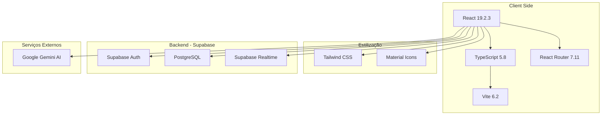

### Princípios Arquiteturais

1. **Componentes Funcionais**: Utilização exclusiva de React Hooks (useState, useEffect, useMemo, useCallback)
2. **Tipagem Forte**: TypeScript em toda a aplicação para segurança de tipos
3. **Context API**: AuthContext para gerenciamento de autenticação
4. **Custom Hooks**: Lógica de dados encapsulada em hooks (useProfiles, useVacations)
5. **Separação de Responsabilidades**: Lógica de negócio separada da apresentação
6. **Design Responsivo**: Mobile-first com breakpoints para tablet e desktop

---

## Arquitetura de Componentes

### Hierarquia de Componentes

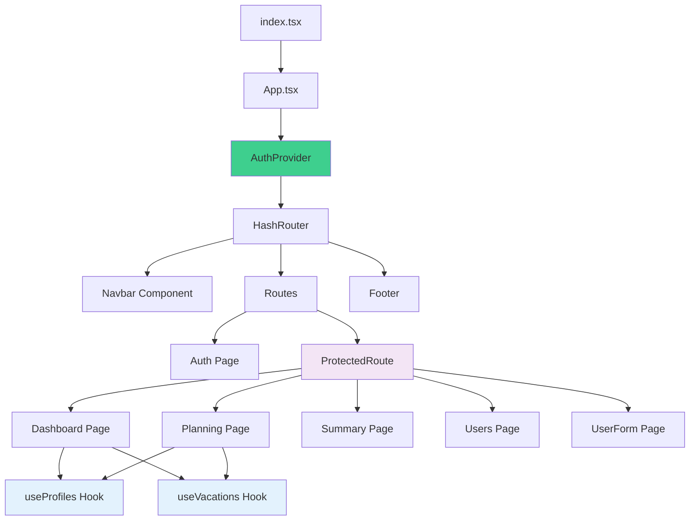

### Estrutura de Arquivos

```
holidayGo/
├── index.tsx              # Ponto de entrada React
├── App.tsx                # Componente raiz com AuthProvider
│
├── lib/                   # Bibliotecas e clientes
│   └── supabaseClient.ts  # Cliente Supabase configurado
│
├── contexts/              # Contextos React
│   └── AuthContext.tsx    # Contexto de autenticação
│
├── hooks/                 # Hooks personalizados
│   ├── useAuth.ts         # Hook de autenticação
│   ├── useProfiles.ts     # CRUD de colaboradores
│   └── useVacations.ts    # Gestão de férias
│
├── components/            # Componentes reutilizáveis
│   └── ProtectedRoute.tsx # Proteção de rotas
│
├── pages/                 # Páginas da aplicação
│   ├── Auth.tsx           # Autenticação (login/registro)
│   ├── Dashboard.tsx      # Dashboard com calendários
│   ├── Planning.tsx       # Planejamento de férias
│   ├── Summary.tsx        # Resumo de saldos
│   ├── Users.tsx          # Listagem de usuários
│   └── UserForm.tsx       # Formulário CRUD usuário
│
├── types/                 # Definições TypeScript
│   └── database.ts        # Tipos do banco Supabase
│
├── supabase/              # Configurações Supabase
│   ├── migrations/
│   │   └── 001_initial_schema.sql
│   └── seed.sql
│
├── types.ts               # Tipos gerais
├── geminiService.ts       # Serviço de IA
└── vite.config.ts         # Configuração build
```

---

## Repository Pattern e Camada de Dados

O holidayGo implementa o **Repository Pattern** para abstrair a fonte de dados. Isso permite alternar entre dados mockados (localStorage) e Supabase sem modificar a lógica de negócio.

### Arquitetura da Camada de Dados

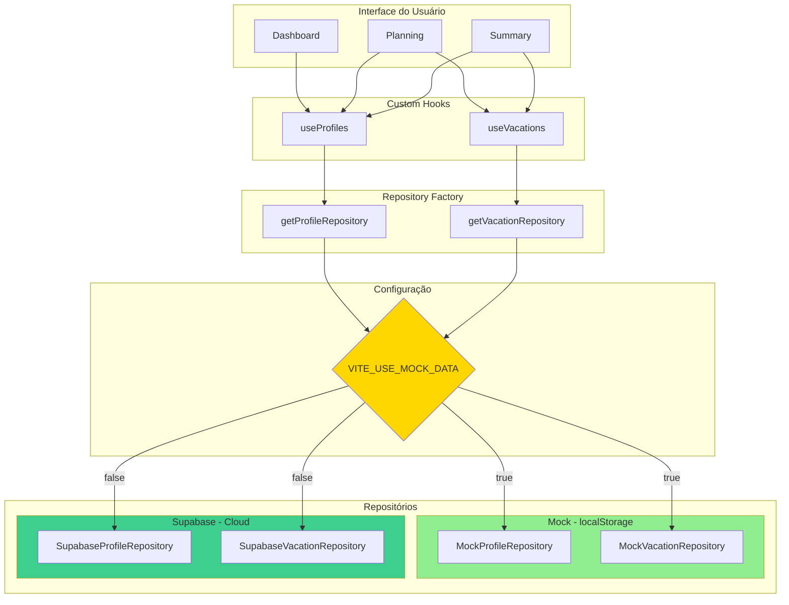

### Interfaces dos Repositórios

```typescript
// lib/repositories/interfaces.ts
export interface IProfileRepository {
  fetchProfiles(): Promise<{ data: Profile[] | null; error: string | null }>;
  getProfile(id: string): Promise<{ data: Profile | null; error: string | null }>;
  createProfile(profile: ProfileInsert): Promise<{ data: Profile | null; error: string | null }>;
  updateProfile(id: string, updates: ProfileUpdate): Promise<{ error: string | null }>;
  deleteProfile(id: string): Promise<{ error: string | null }>;
}

export interface IVacationRepository {
  fetchAllVacations(): Promise<{ data: Vacation[] | null; error: string | null }>;
  getVacationDays(userId: string, year: number, month: number): number[];
  toggleVacationDay(userId: string, year: number, month: number, day: number): Promise<{ error: string | null }>;
  // ...
}
```

### Fluxo de Decisão

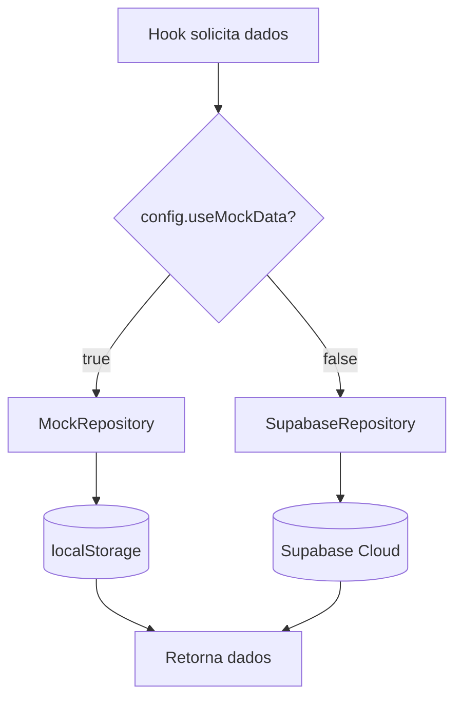

### Benefícios

| Benefício | Descrição |
|-----------|-----------|
| **Desenvolvimento Offline** | Funciona sem conexão ao Supabase |
| **Testes Isolados** | Mock não afeta dados reais |
| **Prototipagem Rápida** | Dados fictícios pré-configurados |
| **Demonstrações** | Ambiente controlado para apresentações |
| **Inversão de Dependência** | Hooks não dependem de implementação específica |

---

## Integração com Supabase

### Arquitetura do Backend

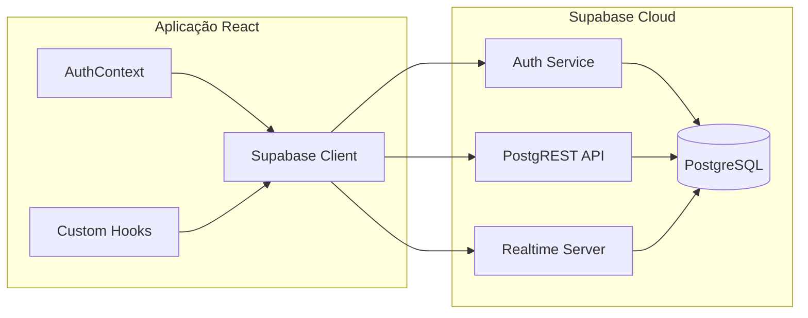

### Schema do Banco de Dados

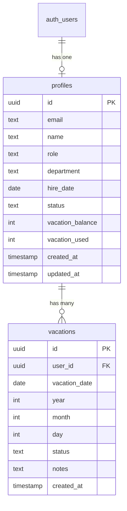

### Row Level Security (RLS)

```sql
-- Políticas de segurança
-- Profiles: Visualização para usuários autenticados
CREATE POLICY "profiles_select_authenticated" ON profiles
    FOR SELECT TO authenticated USING (true);

-- Profiles: Atualização apenas do próprio perfil
CREATE POLICY "profiles_update_own" ON profiles
    FOR UPDATE TO authenticated USING (auth.uid() = id);

-- Vacations: Visualização para usuários autenticados
CREATE POLICY "vacations_select_authenticated" ON vacations
    FOR SELECT TO authenticated USING (true);

-- Vacations: CRUD apenas das próprias férias
CREATE POLICY "vacations_all_own" ON vacations
    FOR ALL TO authenticated USING (auth.uid() = user_id);
```

### Cliente Supabase

```typescript
// lib/supabaseClient.ts
import { createClient } from '@supabase/supabase-js';
import type { Database } from '../types/database';

export const supabase = createClient<Database>(
  import.meta.env.VITE_SUPABASE_URL,
  import.meta.env.VITE_SUPABASE_ANON_KEY,
  {
    auth: {
      persistSession: true,
      autoRefreshToken: true,
    },
  }
);
```

---

## Fluxo de Dados

### Fluxo com Supabase

O holidayGo utiliza um fluxo de dados **reativo** onde os custom hooks se conectam ao Supabase e fornecem dados aos componentes.

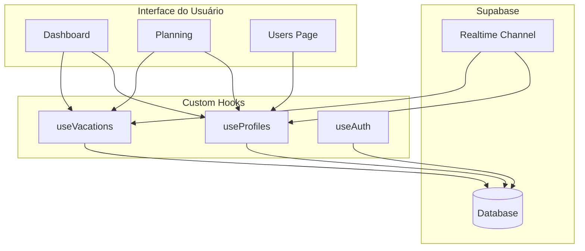

### Ciclo de Vida dos Dados

1. **Inicialização**: Hooks carregam dados do Supabase no mount
2. **Subscriptions**: Real-time listeners atualizam estado automaticamente
3. **Mutação**: Operações CRUD via Supabase API
4. **Otimistic Updates**: Estado local atualizado imediatamente
5. **Sync**: Real-time garante consistência entre clientes

---

## Gerenciamento de Estado

### AuthContext

```typescript
interface AuthState {
  user: User | null;
  profile: Profile | null;
  session: Session | null;
  loading: boolean;
  initialized: boolean;
  error: string | null;
}

interface AuthContextType extends AuthState {
  signIn: (email: string, password: string) => Promise<{ error: AuthError | null }>;
  signUp: (email: string, password: string, name: string) => Promise<{ error: AuthError | null }>;
  signOut: () => Promise<void>;
  updateProfile: (updates: Partial<Profile>) => Promise<{ error: Error | null }>;
}
```

### Custom Hooks

```typescript
// useProfiles - CRUD de colaboradores
const {
  profiles,      // Profile[]
  loading,       // boolean
  error,         // string | null
  fetchProfiles, // () => Promise<void>
  getProfile,    // (id: string) => Promise<Profile | null>
  createProfile, // (data) => Promise<{ data, error }>
  updateProfile, // (id, data) => Promise<{ error }>
  deleteProfile, // (id) => Promise<{ error }>
} = useProfiles();

// useVacations - Gestão de férias
const {
  vacations,         // Vacation[]
  loading,           // boolean
  error,             // string | null
  getVacationDays,   // (userId, year, month) => number[]
  toggleVacationDay, // (userId, year, month, day) => Promise<{ error }>
  addVacationDays,   // (userId, year, month, days[]) => Promise<{ error }>
  removeVacationDays,// (userId, year, month, days[]) => Promise<{ error }>
} = useVacations();
```

### Fluxo de Atualização

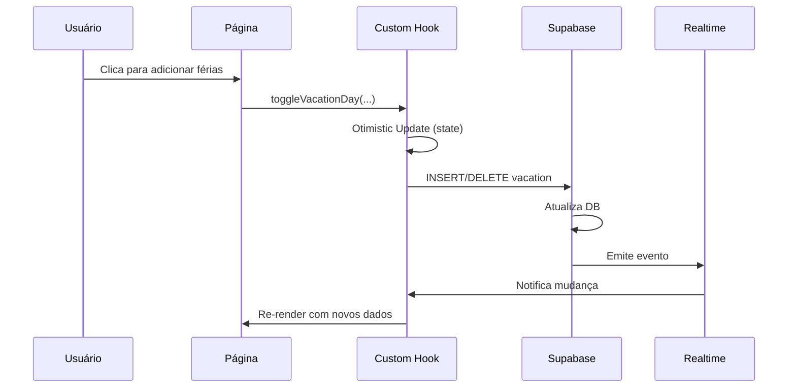

---

## Sistema de Roteamento

### Configuração do React Router

```typescript
<HashRouter>
  <AuthProvider>
    <Navbar />
    <Routes>
      <Route path="/auth" element={<Auth />} />
      <Route path="/" element={
        <ProtectedRoute><Dashboard /></ProtectedRoute>
      } />
      <Route path="/dashboard" element={
        <ProtectedRoute><Dashboard /></ProtectedRoute>
      } />
      <Route path="/planning" element={
        <ProtectedRoute><Planning /></ProtectedRoute>
      } />
      <Route path="/summary" element={
        <ProtectedRoute><Summary /></ProtectedRoute>
      } />
      <Route path="/users" element={
        <ProtectedRoute><Users /></ProtectedRoute>
      } />
      <Route path="/users/add" element={
        <ProtectedRoute><UserForm /></ProtectedRoute>
      } />
      <Route path="/users/edit/:id" element={
        <ProtectedRoute><UserForm /></ProtectedRoute>
      } />
    </Routes>
    <Footer />
  </AuthProvider>
</HashRouter>
```

### Mapa de Rotas

| Rota | Componente | Protegida | Descrição |
|------|-----------|-----------|-----------|
| `/auth` | Auth | ❌ | Login e registro |
| `/` | Dashboard | ✅ | Página inicial |
| `/dashboard` | Dashboard | ✅ | Dashboard com calendários |
| `/planning` | Planning | ✅ | Planejamento de férias |
| `/summary` | Summary | ✅ | Resumo e status |
| `/users` | Users | ✅ | Lista de colaboradores |
| `/users/add` | UserForm | ✅ | Adicionar usuário |
| `/users/edit/:id` | UserForm | ✅ | Editar usuário |

---

## Autenticação

### Fluxo de Autenticação

#### Login

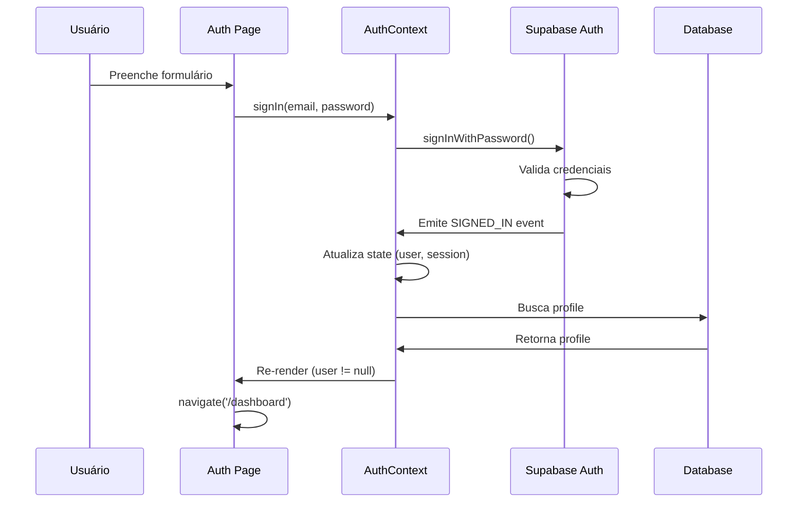

#### Recuperação de Senha

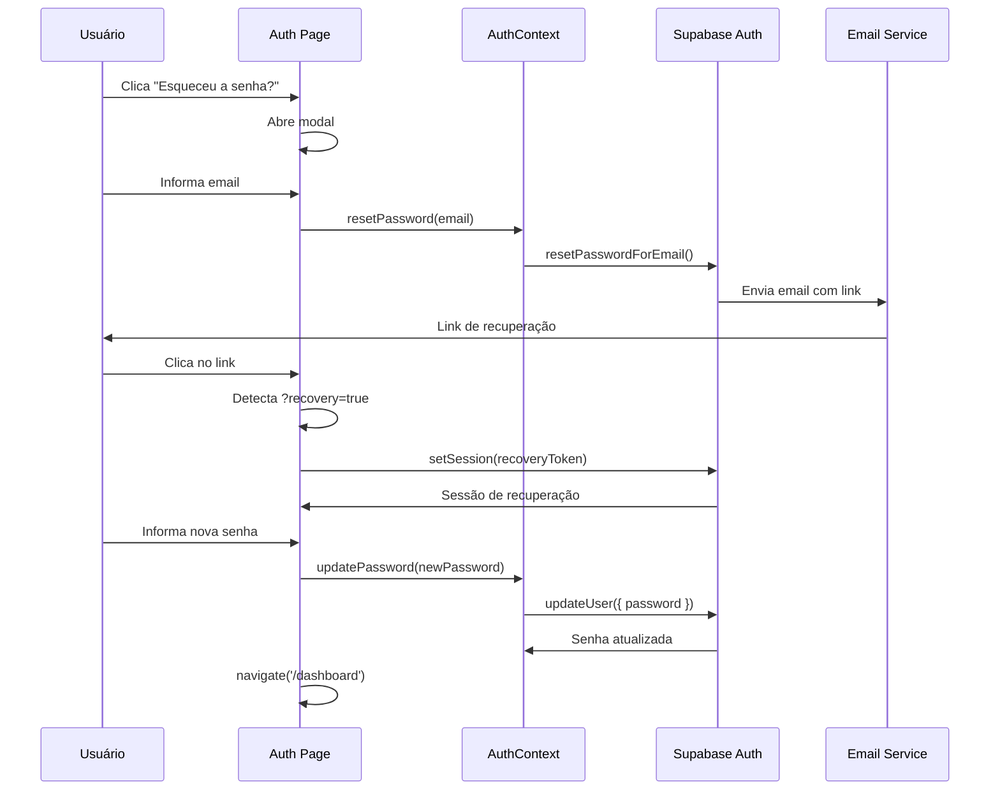

### ProtectedRoute

```typescript
const ProtectedRoute: React.FC<{ children: React.ReactNode }> = ({ children }) => {
  const { user, initialized } = useAuth();
  const location = useLocation();

  if (!initialized) {
    return <LoadingSpinner />;
  }

  if (!user) {
    return <Navigate to="/auth" state={{ from: location }} replace />;
  }

  return <>{children}</>;
};
```

---

## Integração com IA

### Arquitetura do Serviço Gemini

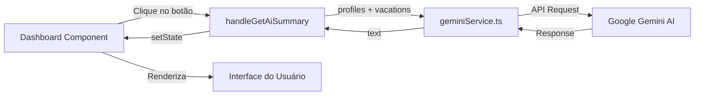

### Implementação do Serviço

```typescript
// geminiService.ts
export const generateTeamSummary = async (
  users: User[], 
  viewMode: 'mensal' | 'anual' = 'mensal',
  selectedMonth?: number,
  selectedYear?: number
): Promise<string> => {
  const ai = new GoogleGenAI({ apiKey: process.env.API_KEY || "" });
  
  // Formatar contexto baseado no modo de visualização
  const teamContext = users.map(u => {
    if (viewMode === 'mensal' && selectedMonth !== undefined) {
      // Modo mensal: mostrar dias específicos do mês
      const monthName = months[selectedMonth];
      return `- ${u.name} (${u.role}): Status ${u.status}, Férias em ${monthName}: ${u.plannedVacations.join(', ') || 'Nenhuma'}`;
    } else {
      // Modo anual: mostrar férias organizadas por mês
      // Decodificar formato: mês*1000 + dia
      const annualData = /* processar dados anuais */;
      return `- ${u.name} (${u.role}): Status ${u.status}, Férias no ano: ${formatAnnualVacations(annualData)}`;
    }
  }).join('\n');

  const periodContext = viewMode === 'mensal' 
    ? `${months[selectedMonth]} de ${selectedYear}`
    : `ano de ${selectedYear}`;

  const prompt = `
    Abaixo está uma lista da equipe e seus status de férias para o ${periodContext}. 
    Gere um resumo executivo curto (máximo 150 palavras) em Português do Brasil.
    ${viewMode === 'anual' ? 'Analise a distribuição de férias ao longo do ano e identifique períodos críticos.' : ''}
    
    Equipe:
    ${teamContext}
  `;

  const response = await ai.models.generateContent({
    model: 'gemini-3-flash-preview',
    contents: prompt,
  });
  
  return response.text || "Erro ao gerar resumo.";
};
```

### Fluxo de Análise de Disponibilidade

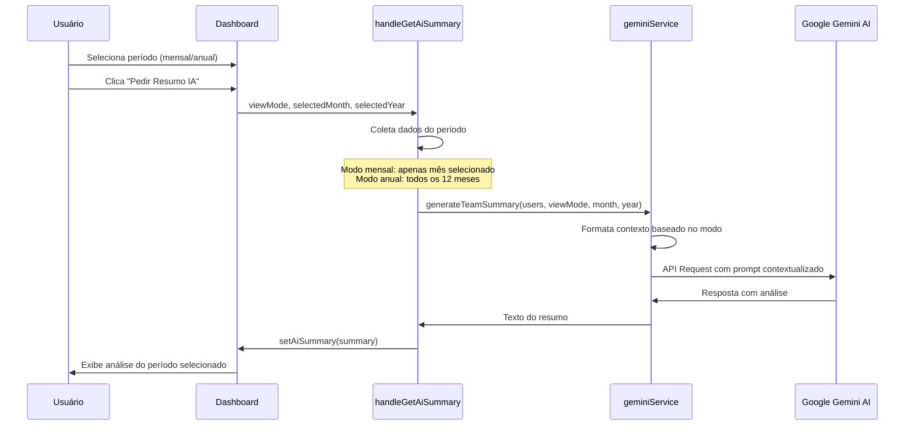

---

## Tema e Estilização

### Sistema de Dark Mode

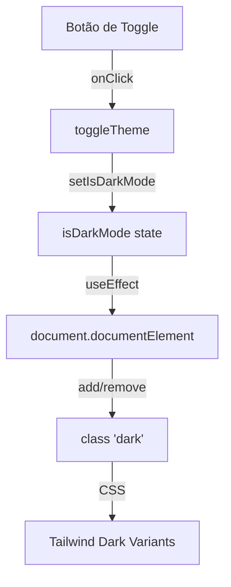

### Paleta de Cores

```css
/* Modo Claro */
--background: white
--surface: slate-50
--text-primary: slate-900
--text-secondary: slate-500
--border: slate-200
--primary: blue-600

/* Modo Escuro (dark:*) */
--background: slate-950
--surface: slate-900
--text-primary: white
--text-secondary: slate-400
--border: slate-800
--primary: blue-500
```

---

## Padrões de Design

### 1. Repository Pattern

Abstrai a fonte de dados, permitindo alternar entre implementações:

```typescript
// Interface define contrato
interface IProfileRepository {
  fetchProfiles(): Promise<{ data: Profile[] | null; error: string | null }>;
}

// Implementações diferentes
class MockProfileRepository implements IProfileRepository { ... }
class SupabaseProfileRepository implements IProfileRepository { ... }

// Factory decide qual usar
const repository = config.useMockData 
  ? new MockProfileRepository() 
  : new SupabaseProfileRepository();
```

### 2. Container/Presentational Pattern

**Container (Smart Component)**
- Gerencia estado e lógica
- Conecta-se a hooks
- Exemplo: `Dashboard.tsx`, `Planning.tsx`

**Presentational (Dumb Component)**
- Apenas renderiza UI
- Exemplo: `StatusBadge`, `Navbar`, `Footer`

### 3. Custom Hooks Pattern

Encapsula lógica de dados em hooks reutilizáveis:

```typescript
// Hook encapsula toda lógica de dados
const { profiles, loading, error, createProfile } = useProfiles();

// Componente foca apenas na UI
if (loading) return <Spinner />;
if (error) return <Error message={error} />;
return <ProfileList profiles={profiles} />;
```

### 4. Context + Hooks Pattern

```typescript
// Contexto provê estado global
const AuthContext = createContext<AuthContextType | undefined>(undefined);

// Hook consome o contexto
export const useAuth = () => {
  const context = useContext(AuthContext);
  if (!context) throw new Error('useAuth must be within AuthProvider');
  return context;
};
```

### 5. Optimistic Updates

```typescript
const toggleVacationDay = async (userId, year, month, day) => {
  // 1. Atualiza estado local imediatamente
  setVacations(prev => [...prev, newVacation]);
  
  // 2. Persiste no banco
  const { error } = await supabase.from('vacations').insert(newVacation);
  
  // 3. Reverte se houver erro
  if (error) {
    setVacations(prev => prev.filter(v => v.id !== newVacation.id));
    return { error: error.message };
  }
  
  return { error: null };
};
```

---

## Segurança

### Proteção de API Keys

```typescript
// vite.config.ts
define: {
  'process.env.API_KEY': JSON.stringify(env.GEMINI_API_KEY),
}
```

- API keys nunca commitadas no código
- Carregadas de `.env.local`
- Injetadas em tempo de build

### Row Level Security

- Todas as tabelas protegidas com RLS
- Políticas granulares por operação (SELECT, INSERT, UPDATE, DELETE)
- Autenticação via JWT verificada pelo Supabase

### Validação de Dados

- TypeScript garante tipagem forte
- Validação de formulários no frontend
- Constraints no banco de dados

---

## Escalabilidade

### Preparação para Crescimento

O código atual está preparado para evoluir:

1. ✅ **Context API** - Implementado para autenticação
2. ✅ **Custom Hooks** - Isolam lógica de dados
3. ✅ **Backend Real** - Supabase integrado
4. ✅ **Autenticação Real** - Supabase Auth implementado
5. ✅ **Repository Pattern** - Abstração de fonte de dados
6. ✅ **Modo Mock** - Desenvolvimento offline com localStorage
7. ⏳ **Testes** - Jest, React Testing Library
8. ⏳ **CI/CD** - GitHub Actions

### Pontos de Extensão

- **Repository Pattern** permite trocar fonte de dados facilmente
- Serviços isolados facilitam mocking e testes
- Tipos TypeScript centralizados
- Componentes desacoplados
- Real-time pronto para colaboração multi-usuário
- Modo mock para demonstrações e prototipagem

---

## Conclusão

A arquitetura do holidayGo prioriza:

- ✅ **Simplicidade**: Sem over-engineering
- ✅ **Manutenibilidade**: Código limpo e organizado
- ✅ **Escalabilidade**: Preparado para crescer
- ✅ **Performance**: Otimizações estratégicas
- ✅ **Segurança**: RLS + Autenticação robusta
- ✅ **Developer Experience**: TypeScript + Vite + Supabase
- ✅ **Real-time**: Atualizações em tempo real

Para mais detalhes sobre componentes específicos, consulte [COMPONENTS.md](COMPONENTS.md).
