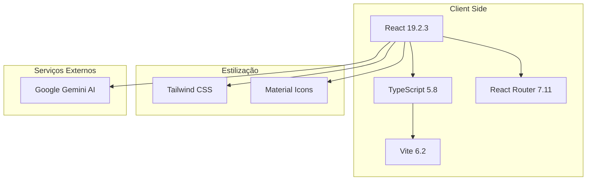
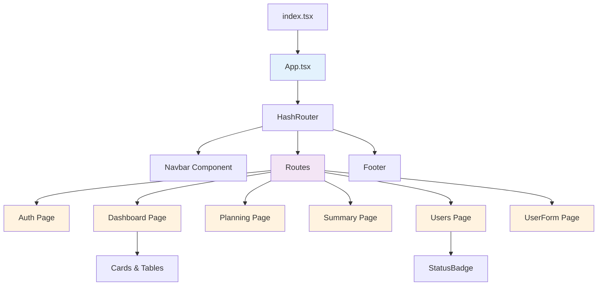
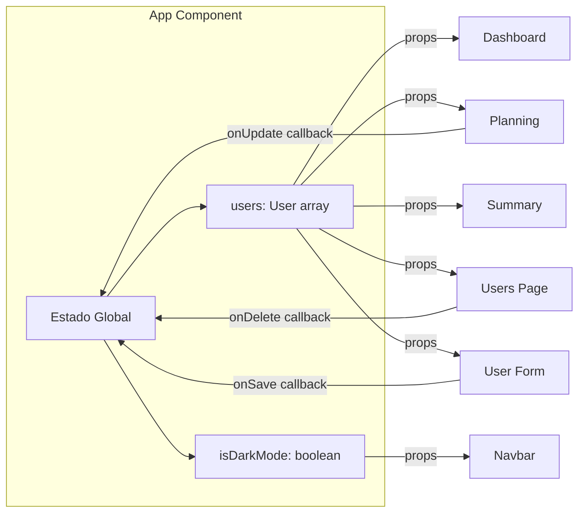
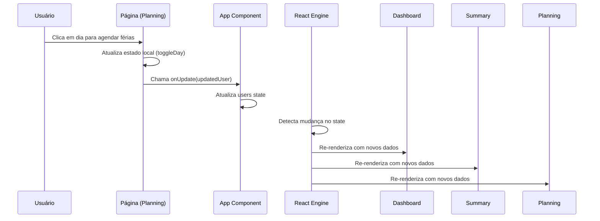
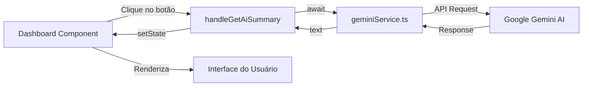
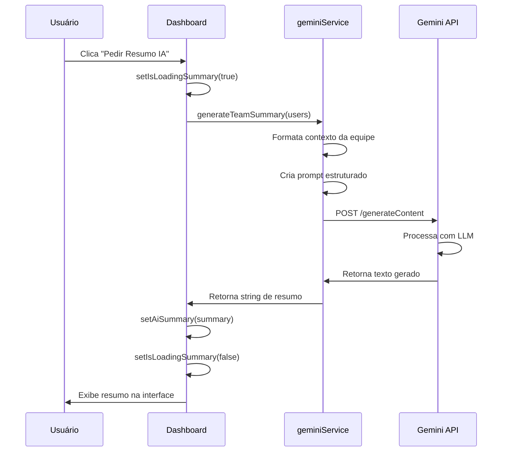
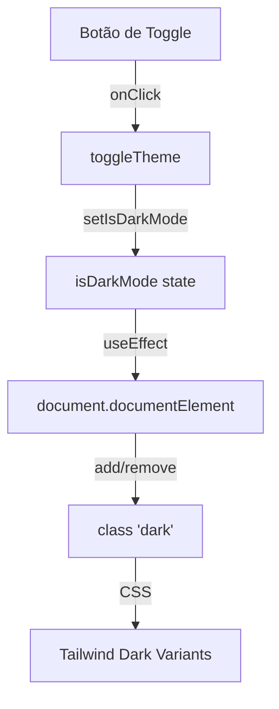
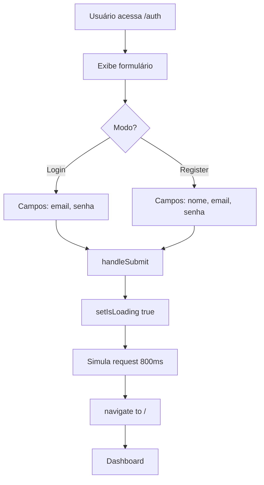
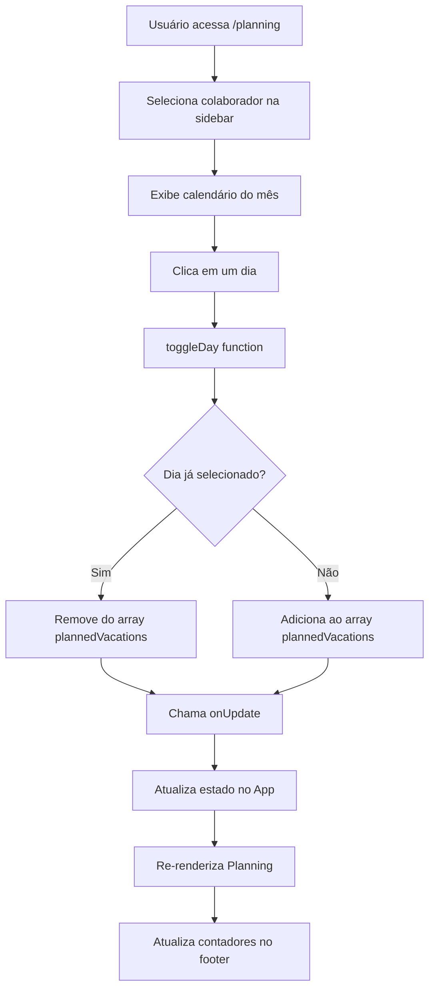
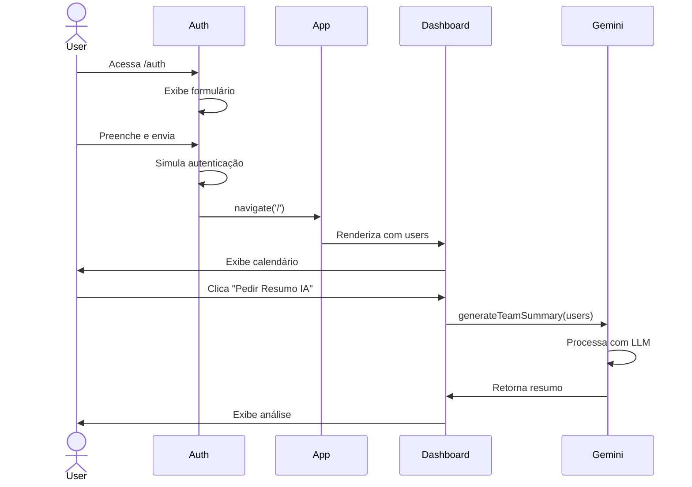

# 🏗️ Arquitetura do Sistema holidayGo

Este documento descreve a arquitetura técnica, padrões de design e fluxos de dados da aplicação holidayGo.

## Índice

- [Visão Geral](#visão-geral)
- [Arquitetura de Componentes](#arquitetura-de-componentes)
- [Fluxo de Dados](#fluxo-de-dados)
- [Gerenciamento de Estado](#gerenciamento-de-estado)
- [Sistema de Roteamento](#sistema-de-roteamento)
- [Integração com IA](#integração-com-ia)
- [Tema e Estilização](#tema-e-estilização)
- [Padrões de Design](#padrões-de-design)

---

## Visão Geral

O holidayGo é uma **Single Page Application (SPA)** construída com React 19 e TypeScript. A aplicação segue uma arquitetura baseada em componentes funcionais com hooks, utilizando React Router para navegação e gerenciamento de estado local no componente raiz.

### Stack Tecnológico



### Princípios Arquiteturais

1. **Componentes Funcionais**: Utilização exclusiva de React Hooks (useState, useEffect, useMemo)
2. **Tipagem Forte**: TypeScript em toda a aplicação para segurança de tipos
3. **Prop Drilling**: Passagem de props do componente raiz para páginas filhas
4. **Separação de Responsabilidades**: Lógica de negócio separada da apresentação
5. **Design Responsivo**: Mobile-first com breakpoints para tablet e desktop

---

## Arquitetura de Componentes

### Hierarquia de Componentes



### Estrutura de Arquivos

```
holidayGo/
├── index.tsx              # Ponto de entrada React
├── App.tsx                # Componente raiz com estado global
│
├── pages/                 # Páginas da aplicação
│   ├── Auth.tsx          # Autenticação (login/registro)
│   ├── Dashboard.tsx     # Dashboard com calendários
│   ├── Planning.tsx      # Planejamento de férias
│   ├── Summary.tsx       # Resumo de saldos
│   ├── Users.tsx         # Listagem de usuários
│   └── UserForm.tsx      # Formulário CRUD usuário
│
├── types.ts              # Definições TypeScript
├── constants.ts          # Dados mockados iniciais
├── geminiService.ts      # Serviço de IA
│
└── vite.config.ts        # Configuração build
```

---

## Fluxo de Dados

### Fluxo Unidirecional

O holidayGo utiliza um fluxo de dados **top-down** (unidirecional) onde o estado é gerenciado no componente `App` e passado como props para os componentes filhos.



### Ciclo de Vida dos Dados

1. **Inicialização**: Estado carregado com `INITIAL_USERS` do arquivo constants.ts
2. **Propagação**: Props distribuídas via React Router para páginas
3. **Mutação**: Callbacks (`onUpdate`, `onDelete`, `onSave`) modificam estado no App
4. **Re-renderização**: React propaga mudanças para componentes dependentes

---

## Gerenciamento de Estado

### Estado no Componente App

```typescript
const App: React.FC = () => {
  // Estado de usuários
  const [users, setUsers] = useState<User[]>(INITIAL_USERS);
  
  // Estado de tema
  const [isDarkMode, setIsDarkMode] = useState(false);

  // Funções de mutação
  const addUser = (user: User) => setUsers([...users, user]);
  const updateUser = (updatedUser: User) => 
    setUsers(users.map(u => u.id === updatedUser.id ? updatedUser : u));
  const deleteUser = (id: string) => 
    setUsers(users.filter(u => u.id !== id));
};
```

### Estados Locais nas Páginas

Cada página mantém seu próprio estado local para:

- **Dashboard**: `viewMode`, `selectedMonth`, `selectedYear`, `aiSummary`
- **Planning**: `selectedUserId`
- **UserForm**: `formData` com validações
- **Auth**: `mode` (login/register), `isLoading`

### Fluxo de Atualização



---

## Sistema de Roteamento

### Configuração do React Router

O holidayGo utiliza `HashRouter` para compatibilidade com ambientes estáticos.

```typescript
<HashRouter>
  <Navbar />
  <Routes>
    <Route path="/" element={<Dashboard users={users} />} />
    <Route path="/summary" element={<Summary users={users} />} />
    <Route path="/users" element={<Users users={users} onDelete={deleteUser} />} />
    <Route path="/planning" element={<Planning users={users} onUpdate={updateUser} />} />
    <Route path="/users/add" element={<UserForm onSave={addUser} />} />
    <Route path="/users/edit/:id" element={<UserForm users={users} onSave={updateUser} />} />
    <Route path="/auth" element={<Auth />} />
  </Routes>
  <Footer />
</HashRouter>
```

### Mapa de Rotas

| Rota | Componente | Descrição | Props |
|------|-----------|-----------|-------|
| `/` | Dashboard | Página inicial com calendários | `users` |
| `/auth` | Auth | Login e registro | - |
| `/planning` | Planning | Planejamento de férias | `users`, `onUpdate` |
| `/summary` | Summary | Resumo e status | `users` |
| `/users` | Users | Lista de colaboradores | `users`, `onDelete` |
| `/users/add` | UserForm | Adicionar usuário | `onSave` |
| `/users/edit/:id` | UserForm | Editar usuário | `users`, `onSave` |

### Navegação Condicional

A Navbar é ocultada na rota `/auth`:

```typescript
if (location.pathname === '/auth') return null;
```

---

## Integração com IA

### Arquitetura do Serviço Gemini



### Implementação do Serviço

```typescript
// geminiService.ts
export const generateTeamSummary = async (users: User[]): Promise<string> => {
  const ai = new GoogleGenAI({ apiKey: process.env.API_KEY || "" });
  
  // Contexto formatado
  const teamContext = users.map(u => 
    `- ${u.name} (${u.role}): Status ${u.status}, 
     Férias este mês: ${u.plannedVacations.length > 0 
       ? u.plannedVacations.join(',') : 'Nenhuma'}`
  ).join('\n');

  // Prompt estruturado
  const prompt = `
    Abaixo está uma lista da equipe e seus status de férias. 
    Gere um resumo executivo curto (máximo 150 palavras) em Português do Brasil.
    
    Equipe:
    ${teamContext}
  `;

  // Chamada à API
  const response = await ai.models.generateContent({
    model: 'gemini-3-flash-preview',
    contents: prompt,
  });
  
  return response.text || "Erro ao gerar resumo.";
};
```

### Fluxo de Análise de IA



---

## Tema e Estilização

### Sistema de Dark Mode



### Implementação

```typescript
const [isDarkMode, setIsDarkMode] = useState(false);

useEffect(() => {
  if (isDarkMode) {
    document.documentElement.classList.add('dark');
  } else {
    document.documentElement.classList.remove('dark');
  }
}, [isDarkMode]);
```

### Paleta de Cores

```css
/* Modo Claro */
--background: white
--surface: slate-50
--text-primary: slate-900
--text-secondary: slate-500
--border: slate-200
--primary: blue-600

/* Modo Escuro (dark:*) */
--background: slate-950
--surface: slate-900
--text-primary: white
--text-secondary: slate-400
--border: slate-800
--primary: blue-500
```

### Convenções Tailwind

- `dark:bg-surface-dark` - Fundo de cards no dark mode
- `dark:text-white` - Texto principal
- `dark:border-slate-800` - Bordas
- `dark:hover:bg-slate-800` - Estados de hover

---

## Padrões de Design

### 1. Container/Presentational Pattern

**Container (Smart Component)**
- Gerencia estado e lógica
- Exemplo: `App.tsx`, `Dashboard.tsx`

**Presentational (Dumb Component)**
- Apenas renderiza UI
- Exemplo: `StatusBadge`, `Navbar`, `Footer`

### 2. Compound Components

A Navbar é um componente composto dentro do App:

```typescript
const Navbar: React.FC<{ isDarkMode: boolean, toggleTheme: () => void }> = 
  ({ isDarkMode, toggleTheme }) => {
  // Lógica de navegação
};
```

### 3. Custom Hooks Pattern

Uso de `useMemo` para otimização de cálculos:

```typescript
const getMonthWeekDays = useMemo(() => {
  const daysCount = getDaysInMonth(selectedMonth, selectedYear);
  // Cálculo pesado
  return labels;
}, [selectedMonth, selectedYear]);
```

### 4. Render Props Pattern

Callbacks passadas como props:

```typescript
<Users 
  users={users} 
  onDelete={(id) => setUsers(users.filter(u => u.id !== id))} 
/>
```

### 5. Conditional Rendering

Múltiplas estratégias:

```typescript
// Early return
if (location.pathname === '/auth') return null;

// Ternário
{mode === 'login' ? 'Bem-vindo' : 'Cadastre-se'}

// Operador &&
{isLoading && <Spinner />}

// Componente condicional
{viewMode === 'mensal' ? <MonthView /> : <YearView />}
```

### 6. Form Controlled Components

Formulários totalmente controlados:

```typescript
const [formData, setFormData] = useState<Partial<User>>({...});

<input
  value={formData.name}
  onChange={e => setFormData({ ...formData, name: e.target.value })}
/>
```

---

## Fluxos Principais

### Fluxo de Autenticação



### Fluxo de Planejamento de Férias



### Fluxo CRUD de Usuários

```mermaid
graph TD
    List[Users Page] --> Action{Ação}
    
    Action -->|Novo| Add[/users/add]
    Action -->|Editar| Edit[/users/edit/:id]
    Action -->|Excluir| Delete[onDelete]
    
    Add --> Form1[UserForm modo create]
    Edit --> Form2[UserForm modo edit]
    
    Form1 --> Submit1[handleSubmit]
    Form2 --> Submit2[handleSubmit]
    
    Submit1 --> Create[addUser]
    Submit2 --> UpdateFunc[updateUser]
    Delete --> Filter[setUsers com filter]
    
    Create --> Navigate1[navigate to /users]
    UpdateFunc --> Navigate2[navigate to /users]
    Filter --> Rerender[Re-renderiza lista]
```

---

## Otimizações de Performance

### 1. useMemo para Cálculos Pesados

```typescript
const getMonthWeekDays = useMemo(() => {
  // Evita recalcular a cada render
  return calculatedDays;
}, [selectedMonth, selectedYear]);
```

### 2. Early Returns

```typescript
if (location.pathname === '/auth') return null;
// Evita renderizar Navbar desnecessariamente
```

### 3. Lazy Evaluation

```typescript
const isVacation = (selectedMonth === 6 && selectedYear === 2026) 
  && user.plannedVacations.includes(day);
// Avaliação curto-circuito
```

### 4. Key Props em Listas

```typescript
{users.map((user) => (
  <tr key={user.id}>
    {/* Otimiza reconciliação do React */}
  </tr>
))}
```

---

## Segurança

### Proteção de API Keys

```typescript
// vite.config.ts
define: {
  'process.env.API_KEY': JSON.stringify(env.GEMINI_API_KEY),
}
```

- API key nunca commitada no código
- Carregada de `.env.local`
- Injetada em tempo de build

### Validação de Formulários

- Campos `required` em todos os inputs críticos
- Validação de tipo email nativo do HTML5
- Prevenção de submit sem dados válidos

### Sanitização de Dados

- TypeScript garante tipagem forte
- Validação de props com interfaces
- Conversão explícita de tipos numéricos

---

## Escalabilidade

### Preparação para Crescimento

O código atual está preparado para evoluir para:

1. **Context API** - Substituir prop drilling por contextos
2. **Redux/Zustand** - Gerenciamento de estado mais robusto
3. **React Query** - Cache e sincronização de dados
4. **Backend Real** - Substituir INITIAL_USERS por API REST
5. **Autenticação Real** - JWT, OAuth, etc.
6. **Testes** - Jest, React Testing Library, Cypress

### Pontos de Extensão

- Serviços isolados (geminiService.ts) facilitam mocking
- Tipos TypeScript centralizados (types.ts)
- Componentes desacoplados
- Roteamento modular

---

## Diagramas de Sequência Completos

### Login + Dashboard + IA



---

## Conclusão

A arquitetura do holidayGo prioriza:

- ✅ **Simplicidade**: Sem over-engineering
- ✅ **Manutenibilidade**: Código limpo e organizado
- ✅ **Escalabilidade**: Preparado para crescer
- ✅ **Performance**: Otimizações estratégicas
- ✅ **Segurança**: Boas práticas aplicadas
- ✅ **Developer Experience**: TypeScript + Vite

Para mais detalhes sobre componentes específicos, consulte [COMPONENTS.md](COMPONENTS.md).

