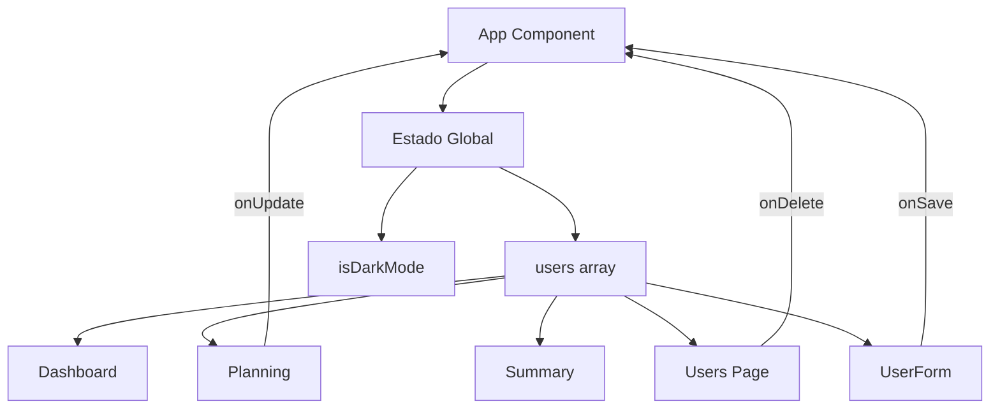
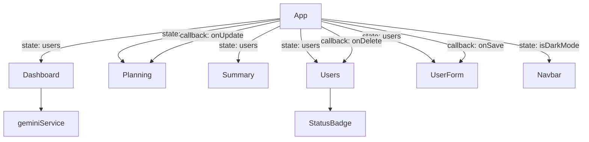

# 🧩 Documentação de Componentes - holidayGo

Documentação detalhada de todos os componentes React da aplicação holidayGo.

## Índice

- [Componentes Principais](#componentes-principais)
  - [App](#app)
  - [Navbar](#navbar)
- [Páginas](#páginas)
  - [Auth](#auth)
  - [Dashboard](#dashboard)
  - [Planning](#planning)
  - [Summary](#summary)
  - [Users](#users)
  - [UserForm](#userform)
- [Componentes Auxiliares](#componentes-auxiliares)
  - [StatusBadge](#statusbadge)
  - [Footer](#footer)

---

## Componentes Principais

### App

**Arquivo**: `App.tsx`

Componente raiz da aplicação. Gerencia o estado global, roteamento e tema.

#### Responsabilidades

- Gerenciar lista de usuários (CRUD)
- Controlar tema (dark/light mode)
- Configurar roteamento
- Prover callbacks para componentes filhos

#### Estado

```typescript
const [users, setUsers] = useState<User[]>(INITIAL_USERS);
const [isDarkMode, setIsDarkMode] = useState(false);
```

| Estado | Tipo | Descrição |
|--------|------|-----------|
| `users` | `User[]` | Lista de todos os colaboradores |
| `isDarkMode` | `boolean` | Estado do tema (claro/escuro) |

#### Métodos

```typescript
const addUser = (user: User) => void
const updateUser = (updatedUser: User) => void
const deleteUser = (id: string) => void
const toggleTheme = () => void
```

#### Estrutura

```typescript
const App: React.FC = () => {
  // Estados
  const [users, setUsers] = useState<User[]>(INITIAL_USERS);
  const [isDarkMode, setIsDarkMode] = useState(false);

  // Effect para aplicar tema
  useEffect(() => {
    if (isDarkMode) {
      document.documentElement.classList.add('dark');
    } else {
      document.documentElement.classList.remove('dark');
    }
  }, [isDarkMode]);

  // Funções CRUD
  const addUser = (user: User) => setUsers([...users, user]);
  const updateUser = (updatedUser: User) => 
    setUsers(users.map(u => u.id === updatedUser.id ? updatedUser : u));
  const deleteUser = (id: string) => 
    setUsers(users.filter(u => u.id !== id));

  return (
    <HashRouter>
      <Navbar isDarkMode={isDarkMode} toggleTheme={toggleTheme} />
      <Routes>
        {/* Rotas */}
      </Routes>
      <Footer />
    </HashRouter>
  );
};
```

#### Fluxo de Dados



---

### Navbar

**Arquivo**: `App.tsx` (componente interno)

Barra de navegação principal da aplicação.

#### Props

```typescript
interface NavbarProps {
  isDarkMode: boolean;
  toggleTheme: () => void;
}
```

| Prop | Tipo | Descrição |
|------|------|-----------|
| `isDarkMode` | `boolean` | Estado atual do tema |
| `toggleTheme` | `() => void` | Callback para alternar tema |

#### Funcionalidades

- Links de navegação para todas as páginas
- Indicador visual de rota ativa
- Botão de toggle de tema (sol/lua)
- Avatar do usuário
- Responsivo com menu mobile
- Oculta-se na página `/auth`

#### Estrutura

```typescript
const Navbar: React.FC<NavbarProps> = ({ isDarkMode, toggleTheme }) => {
  const location = useLocation();
  const isActive = (path: string) => location.pathname === path;

  // Não renderiza na página de auth
  if (location.pathname === '/auth') return null;

  return (
    <nav className="bg-white dark:bg-surface-dark border-b sticky top-0 z-50">
      <div className="max-w-[1920px] mx-auto px-4">
        <div className="flex justify-between h-16">
          {/* Logo */}
          <Link to="/">
            <span className="material-icons-round text-primary">flight_takeoff</span>
            <span className="font-bold">holidayGo</span>
          </Link>
          
          {/* Links de navegação */}
          <div className="flex space-x-8">
            <Link to="/" className={isActive('/') ? 'active' : ''}>
              Dashboard
            </Link>
            <Link to="/planning">Planejamento</Link>
            <Link to="/summary">Resumo</Link>
            <Link to="/users">Colaboradores</Link>
          </div>
          
          {/* Controles à direita */}
          <div className="flex items-center gap-4">
            <button onClick={toggleTheme}>
              <span className="material-icons-round">
                {isDarkMode ? 'light_mode' : 'dark_mode'}
              </span>
            </button>
            <div className="avatar">AD</div>
          </div>
        </div>
      </div>
    </nav>
  );
};
```

#### Estilização de Links Ativos

```typescript
className={`${
  isActive('/') 
    ? 'border-primary text-slate-900 dark:text-white' 
    : 'border-transparent text-slate-500 hover:text-slate-700'
} inline-flex items-center px-1 pt-1 border-b-2`}
```

---

## Páginas

### Auth

**Arquivo**: `pages/Auth.tsx`

Página de autenticação com login e registro.

#### Props

Nenhuma (componente standalone).

#### Estado Local

```typescript
const [mode, setMode] = useState<'login' | 'register'>('login');
const [isLoading, setIsLoading] = useState(false);
```

| Estado | Tipo | Descrição |
|--------|------|-----------|
| `mode` | `'login' \| 'register'` | Modo atual do formulário |
| `isLoading` | `boolean` | Estado de carregamento |

#### Funcionalidades

- Formulário de login (email + senha)
- Formulário de registro (nome + email + senha)
- Alternância entre modos
- Validação de campos
- Simulação de autenticação (800ms delay)
- Redirecionamento para Dashboard após login
- Design split-screen com imagem
- Cards flutuantes animados
- Link "Esqueceu a senha?"

#### Estrutura

```typescript
const Auth: React.FC = () => {
  const navigate = useNavigate();
  const [mode, setMode] = useState<'login' | 'register'>('login');
  const [isLoading, setIsLoading] = useState(false);

  const handleSubmit = (e: React.FormEvent) => {
    e.preventDefault();
    setIsLoading(true);
    setTimeout(() => {
      setIsLoading(false);
      navigate('/');
    }, 800);
  };

  const toggleMode = () => {
    setMode(prev => prev === 'login' ? 'register' : 'login');
  };

  return (
    <div className="min-h-screen flex">
      {/* Lado esquerdo: Formulário */}
      <div className="flex-1">
        <form onSubmit={handleSubmit}>
          {/* Campos do formulário */}
        </form>
      </div>
      
      {/* Lado direito: Visual */}
      <div className="hidden lg:flex lg:w-1/2">
        {/* Imagem e overlay */}
      </div>
    </div>
  );
};
```

#### Layout Split-Screen

```
┌──────────────┬──────────────┐
│   Formulário │    Imagem    │
│   (inputs)   │   + Texto    │
│              │   Marketing  │
└──────────────┴──────────────┘
```

#### Validações

- Campos `required` nativos do HTML5
- Tipo `email` para validação de formato
- Tipo `password` para ocultar senha
- Estado `disabled` durante loading

---

### Dashboard

**Arquivo**: `pages/Dashboard.tsx`

Dashboard principal com calendários de férias.

#### Props

```typescript
interface DashboardProps {
  users: User[];
}
```

| Prop | Tipo | Descrição |
|------|------|-----------|
| `users` | `User[]` | Lista de colaboradores |

#### Estado Local

```typescript
const [viewMode, setViewMode] = useState<'mensal' | 'anual'>('mensal');
const [selectedMonth, setSelectedMonth] = useState(6); // Julho
const [selectedYear, setSelectedYear] = useState(2026);
const [aiSummary, setAiSummary] = useState<string | null>(null);
const [isLoadingSummary, setIsLoadingSummary] = useState(false);
```

| Estado | Tipo | Descrição |
|--------|------|-----------|
| `viewMode` | `'mensal' \| 'anual'` | Modo de visualização |
| `selectedMonth` | `number` | Mês selecionado (0-11) |
| `selectedYear` | `number` | Ano selecionado |
| `aiSummary` | `string \| null` | Resumo gerado pela IA |
| `isLoadingSummary` | `boolean` | Loading da IA |

#### Funcionalidades

**Visualização Mensal**:
- Calendário em grid com todos os dias do mês
- Nome do colaborador na primeira coluna (sticky)
- Dias com férias marcados em azul (primary)
- Finais de semana destacados em vermelho
- Labels com dia da semana (D, 2ª, 3ª...)
- Hover mostra ícone de praia

**Visualização Anual**:
- Consolidado de 12 meses
- Contadores por mês para cada usuário
- Total de dias no final da linha
- Badges coloridos (> 10 dias em destaque)

**Análise com IA**:
- Botão "Pedir Resumo IA"
- Loading state durante processamento
- Exibe análise em português
- Recomendações de cobertura

**Estatísticas**:
- Média mensal de colaboradores em férias
- Pico de ausência
- Cards informativos

**Exportação**:
- Botões para PDF e Excel (mock)

#### Métodos

```typescript
const getDaysInMonth = (month: number, year: number): number
const getMonthWeekDays = useMemo(() => string[], [selectedMonth, selectedYear])
const handleGetAiSummary = async (): Promise<void>
const getAnnualData = (user: User, monthIdx: number): number
```

#### Estrutura

```typescript
const Dashboard: React.FC<DashboardProps> = ({ users }) => {
  // Estados
  const [viewMode, setViewMode] = useState<'mensal' | 'anual'>('mensal');
  
  // Memoização de cálculos pesados
  const getMonthWeekDays = useMemo(() => {
    // Calcula dias da semana
  }, [selectedMonth, selectedYear]);
  
  // Handler da IA
  const handleGetAiSummary = async () => {
    setIsLoadingSummary(true);
    const summary = await generateTeamSummary(users);
    setAiSummary(summary);
    setIsLoadingSummary(false);
  };

  return (
    <div className="py-8 px-4 max-w-[1920px] mx-auto">
      {/* Header com controles */}
      
      {/* Tabela de calendário */}
      {viewMode === 'mensal' ? (
        <MonthlyView />
      ) : (
        <AnnualView />
      )}
      
      {/* Cards de estatísticas */}
      
      {/* Seção de IA */}
      <div className="bg-gradient-to-br from-indigo-50">
        <button onClick={handleGetAiSummary}>
          Pedir Resumo IA
        </button>
        {aiSummary && <p>{aiSummary}</p>}
      </div>
    </div>
  );
};
```

#### Layout

```
┌─────────────────────────────────────┐
│ Header: Título + Toggle + Selects  │
├─────────────────────────────────────┤
│                                     │
│   Calendário (Mensal ou Anual)     │
│   ┌──────┬───┬───┬───┬───┬───┐    │
│   │ Nome │ 1 │ 2 │ 3 │...│ 31│    │
│   ├──────┼───┼───┼───┼───┼───┤    │
│   │ User │ ░ │ ░ │ █ │...│   │    │
│   └──────┴───┴───┴───┴───┴───┘    │
│                                     │
├─────────────────────────────────────┤
│ Cards: Média │ Pico │ Legenda       │
├─────────────────────────────────────┤
│ Análise de IA [Botão] [Resultado]  │
└─────────────────────────────────────┘
```

---

### Planning

**Arquivo**: `pages/Planning.tsx`

Interface de planejamento interativo de férias.

#### Props

```typescript
interface PlanningProps {
  users: User[];
  onUpdate: (user: User) => void;
}
```

| Prop | Tipo | Descrição |
|------|------|-----------|
| `users` | `User[]` | Lista de colaboradores |
| `onUpdate` | `(user: User) => void` | Callback ao atualizar usuário |

#### Estado Local

```typescript
const [selectedUserId, setSelectedUserId] = useState<string>(users[0]?.id || '');
```

| Estado | Tipo | Descrição |
|--------|------|-----------|
| `selectedUserId` | `string` | ID do colaborador selecionado |

#### Funcionalidades

- Sidebar com lista de colaboradores
- Calendário interativo do mês (Julho 2026)
- Clique em dias para marcar/desmarcar férias
- Finais de semana destacados
- Footer com resumo (dias programados + saldo)
- Botão "Salvar Alterações"
- Indicadores visuais de dias selecionados
- Navegação entre meses (botões < >)

#### Métodos

```typescript
const toggleDay = (day: number): void
```

Alterna seleção de um dia e atualiza o usuário via callback.

#### Estrutura

```typescript
const Planning: React.FC<PlanningProps> = ({ users, onUpdate }) => {
  const [selectedUserId, setSelectedUserId] = useState(users[0]?.id);
  const selectedUser = users.find(u => u.id === selectedUserId);

  const toggleDay = (day: number) => {
    if (!selectedUser) return;
    
    const isPlanned = selectedUser.plannedVacations.includes(day);
    const newPlanned = isPlanned
      ? selectedUser.plannedVacations.filter(d => d !== day)
      : [...selectedUser.plannedVacations, day].sort((a, b) => a - b);
    
    onUpdate({
      ...selectedUser,
      plannedVacations: newPlanned,
      vacationUsed: newPlanned.length,
      status: newPlanned.length > 0 ? 'Férias' : 'Ativo'
    });
  };

  return (
    <div className="flex flex-col h-[calc(100vh-64px)]">
      {/* Header */}
      
      <div className="flex-grow flex">
        {/* Sidebar de usuários */}
        <aside className="w-64">
          {users.map(u => (
            <button onClick={() => setSelectedUserId(u.id)} key={u.id}>
              {u.name}
            </button>
          ))}
        </aside>
        
        {/* Calendário */}
        <main className="flex-grow">
          <div className="grid grid-cols-7">
            {/* Headers: Seg, Ter, ... */}
            {Array.from({ length: 31 }).map((_, i) => {
              const day = i + 1;
              const isSelected = selectedUser?.plannedVacations.includes(day);
              return (
                <button 
                  key={day} 
                  onClick={() => toggleDay(day)}
                  className={isSelected ? 'bg-primary' : ''}
                >
                  {day}
                </button>
              );
            })}
          </div>
        </main>
      </div>
      
      {/* Footer com resumo */}
      <footer>
        <p>Dias Programados: {selectedUser?.plannedVacations.length}</p>
        <p>Saldo Restante: {selectedUser?.vacationBalance}</p>
      </footer>
    </div>
  );
};
```

#### Layout

```
┌─────────────────────────────────────┐
│ Header: Julho 2026 [< >] [Legenda] │
├──────────┬──────────────────────────┤
│ Sidebar  │   Seg Ter Qua Qui Sex   │
│          │   ┌───┬───┬───┬───┬───┐ │
│ □ Allan  │   │ 1 │ 2 │ 3 │ 4 │ 5 │ │
│ ■ Aline  │   ├───┼───┼───┼───┼───┤ │
│ □ Alex   │   │ 6 │ 7 │ 8 │ 9 │10 │ │
│          │   └───┴───┴───┴───┴───┘ │
├──────────┴──────────────────────────┤
│ Footer: Allan | 5 dias | 65 saldo   │
└─────────────────────────────────────┘
```

---

### Summary

**Arquivo**: `pages/Summary.tsx`

Página de resumo de saldos de férias.

#### Props

```typescript
interface SummaryProps {
  users: User[];
}
```

| Prop | Tipo | Descrição |
|------|------|-----------|
| `users` | `User[]` | Lista de colaboradores |

#### Funcionalidades

- Cards com estatísticas gerais:
  - Média da equipe
  - Alertas de vencimento (≥ 45 dias)
  - Total acumulado
- Seção "Sem Férias Marcadas" (scroll horizontal)
- Seção "Férias se Aproximando"
- Tabela detalhada por colaborador:
  - Nome e cargo
  - Dias agendados
  - Dias restantes
  - Barra de progresso
  - Badge de status (Normal, Atenção, Crítico, Bom)

#### Métodos

```typescript
const getStatus = (remaining: number): StatusObject
```

Retorna objeto com label e cor baseado no saldo:
- `>= 45 dias`: Crítico (vermelho)
- `>= 30 dias`: Atenção (amarelo)
- `>= 15 dias`: Normal (azul)
- `< 15 dias`: Bom (verde)

#### Variáveis Derivadas

```typescript
const usersWithoutVacation = users.filter(
  u => u.plannedVacations.length === 0 && u.status !== 'Inativo'
);

const usersWithUpcomingVacation = users.filter(
  u => u.plannedVacations.length > 0
);
```

#### Estrutura

```typescript
const Summary: React.FC<SummaryProps> = ({ users }) => {
  const getStatus = (remaining: number) => {
    if (remaining >= 45) return { label: 'Crítico', color: 'bg-red-100...' };
    if (remaining >= 30) return { label: 'Atenção', color: 'bg-yellow-100...' };
    if (remaining >= 15) return { label: 'Normal', color: 'bg-blue-100...' };
    return { label: 'Bom', color: 'bg-green-100...' };
  };

  const usersWithoutVacation = users.filter(/* ... */);
  const usersWithUpcomingVacation = users.filter(/* ... */);

  return (
    <div className="py-8 px-4 max-w-7xl mx-auto">
      {/* Título */}
      
      {/* Cards de estatísticas */}
      <div className="grid grid-cols-3 gap-6">
        <StatCard title="Média da Equipe" value={average} />
        <StatCard title="Alertas" value={criticalCount} />
        <StatCard title="Total Acumulado" value={total} />
      </div>
      
      {/* Seções de alertas */}
      <div className="grid grid-cols-2 gap-8">
        <Section title="Sem Férias Marcadas">
          {usersWithoutVacation.map(/* ... */)}
        </Section>
        
        <Section title="Férias se Aproximando">
          {usersWithUpcomingVacation.map(/* ... */)}
        </Section>
      </div>
      
      {/* Tabela detalhada */}
      <table>
        {users.map(user => {
          const status = getStatus(user.vacationBalance);
          return (
            <tr key={user.id}>
              <td>{user.name}</td>
              <td>{user.vacationUsed}</td>
              <td>{user.vacationBalance}</td>
              <td><ProgressBar /></td>
              <td><Badge status={status} /></td>
            </tr>
          );
        })}
      </table>
    </div>
  );
};
```

---

### Users

**Arquivo**: `pages/Users.tsx`

Lista de colaboradores com ações CRUD.

#### Props

```typescript
interface UsersProps {
  users: User[];
  onDelete: (id: string) => void;
}
```

| Prop | Tipo | Descrição |
|------|------|-----------|
| `users` | `User[]` | Lista de colaboradores |
| `onDelete` | `(id: string) => void` | Callback para excluir |

#### Funcionalidades

- Tabela responsiva com todos os usuários
- Colunas: Nome, Status, Cargo, Saldo, Último Acesso
- Avatar ou inicial do nome
- Badge de status colorido
- Barra de progresso do saldo
- Botões de ação:
  - Editar (ícone lápis)
  - Excluir (ícone lixeira)
- Botão "Novo Usuário" no header
- Hover effects nas linhas

#### Estrutura

```typescript
const Users: React.FC<UsersProps> = ({ users, onDelete }) => {
  return (
    <div className="py-8 px-4 max-w-7xl mx-auto">
      {/* Header */}
      <div className="flex justify-between">
        <h1>Gestão de Usuários</h1>
        <Link to="/users/add">
          <button>Novo Usuário</button>
        </Link>
      </div>
      
      {/* Tabela */}
      <table>
        <thead>
          <tr>
            <th>Nome</th>
            <th>Status</th>
            <th>Cargo</th>
            <th>Saldo Férias</th>
            <th>Último Acesso</th>
            <th></th>
          </tr>
        </thead>
        <tbody>
          {users.map(user => (
            <tr key={user.id}>
              <td>
                <Avatar user={user} />
                {user.name}
              </td>
              <td><StatusBadge status={user.status} /></td>
              <td>{user.role}</td>
              <td>
                <ProgressBar value={user.vacationBalance} />
                {user.vacationBalance} dias
              </td>
              <td>{user.lastAccess}</td>
              <td>
                <Link to={`/users/edit/${user.id}`}>
                  <button>edit</button>
                </Link>
                <button onClick={() => onDelete(user.id)}>
                  delete
                </button>
              </td>
            </tr>
          ))}
        </tbody>
      </table>
    </div>
  );
};
```

---

### UserForm

**Arquivo**: `pages/UserForm.tsx`

Formulário para criar ou editar colaboradores.

#### Props

```typescript
interface UserFormProps {
  users?: User[];
  onSave: (user: User) => void;
}
```

| Prop | Tipo | Descrição |
|------|------|-----------|
| `users` | `User[] \| undefined` | Lista completa (para edição) |
| `onSave` | `(user: User) => void` | Callback ao salvar |

#### Estado Local

```typescript
const [formData, setFormData] = useState<Partial<User>>({
  name: '',
  email: '',
  role: '',
  department: '',
  hireDate: '',
  status: 'Ativo',
  vacationBalance: 30,
  vacationUsed: 0,
  plannedVacations: []
});
```

#### Funcionalidades

- Detecção automática de modo (criar vs editar)
- Carregamento de dados existentes em modo edição
- Validação de campos obrigatórios
- Seções organizadas:
  - Informações Pessoais
  - Configurações de Férias
- Breadcrumbs de navegação
- Botão "Voltar"
- Botões "Cancelar" e "Salvar"

#### Métodos

```typescript
const handleSubmit = (e: React.FormEvent): void
```

Valida e envia dados via callback `onSave`, depois redireciona para `/users`.

#### Hooks

```typescript
const { id } = useParams<{ id: string }>();
const navigate = useNavigate();
const isEditing = !!id;

useEffect(() => {
  if (isEditing && users) {
    const user = users.find(u => u.id === id);
    if (user) setFormData(user);
  }
}, [id, users, isEditing]);
```

#### Estrutura

```typescript
const UserForm: React.FC<UserFormProps> = ({ users, onSave }) => {
  const { id } = useParams();
  const navigate = useNavigate();
  const isEditing = !!id;
  
  const [formData, setFormData] = useState<Partial<User>>({/* ... */});

  useEffect(() => {
    // Carrega dados existentes se editando
  }, [id, users, isEditing]);

  const handleSubmit = (e: React.FormEvent) => {
    e.preventDefault();
    const newUser: User = {
      id: isEditing ? id : generateId(),
      // ... preenche todos os campos
    };
    onSave(newUser);
    navigate('/users');
  };

  return (
    <div>
      {/* Breadcrumbs */}
      
      {/* Header */}
      <h1>{isEditing ? 'Editar' : 'Adicionar'} Usuário</h1>
      
      {/* Formulário */}
      <form onSubmit={handleSubmit}>
        <section>
          <h3>Informações Pessoais</h3>
          <input name="name" value={formData.name} onChange={/* ... */} />
          <input name="email" value={formData.email} onChange={/* ... */} />
          <input name="role" value={formData.role} onChange={/* ... */} />
          <select name="status" value={formData.status} onChange={/* ... */}>
            <option>Ativo</option>
            <option>Férias</option>
            <option>Inativo</option>
            <option>Pendente</option>
          </select>
        </section>
        
        <section>
          <h3>Configurações de Férias</h3>
          <input name="department" value={formData.department} onChange={/* ... */} />
          <input name="hireDate" type="date" value={formData.hireDate} onChange={/* ... */} />
          <input name="vacationBalance" type="number" value={formData.vacationBalance} onChange={/* ... */} />
        </section>
        
        <footer>
          <button type="button" onClick={() => navigate('/users')}>
            Cancelar
          </button>
          <button type="submit">
            {isEditing ? 'Salvar Alterações' : 'Criar Usuário'}
          </button>
        </footer>
      </form>
    </div>
  );
};
```

---

## Componentes Auxiliares

### StatusBadge

**Arquivo**: `pages/Users.tsx` (componente interno)

Badge colorido para exibir status do usuário.

#### Props

```typescript
interface StatusBadgeProps {
  status: UserStatus;
}
```

| Prop | Tipo | Descrição |
|------|------|-----------|
| `status` | `UserStatus` | Status do colaborador |

#### Implementação

```typescript
const StatusBadge: React.FC<{ status: UserStatus }> = ({ status }) => {
  const colors: Record<UserStatus, string> = {
    'Ativo': 'bg-green-100 text-green-700 dark:bg-green-900/30 dark:text-green-400',
    'Inativo': 'bg-slate-100 text-slate-700 dark:bg-slate-800 dark:text-slate-400',
    'Férias': 'bg-primary/10 text-primary dark:bg-primary/20',
    'Pendente': 'bg-yellow-100 text-yellow-700 dark:bg-yellow-900/30 dark:text-yellow-400'
  };

  return (
    <span className={`px-2 py-1 text-xs font-bold rounded-full ${colors[status]}`}>
      {status}
    </span>
  );
};
```

#### Uso

```typescript
<StatusBadge status={user.status} />
```

---

### Footer

**Arquivo**: `App.tsx` (JSX direto)

Rodapé da aplicação.

#### Estrutura

```typescript
<footer className="bg-white dark:bg-surface-dark border-t py-6 px-4">
  <div className="max-w-7xl mx-auto text-center">
    <p className="text-slate-400 text-sm">
      © {new Date().getFullYear()} holidayGo System. Todos os direitos reservados.
    </p>
  </div>
</footer>
```

---

## Padrões Comuns

### Estrutura de Página

Todas as páginas seguem este padrão:

```typescript
const PageName: React.FC<PageProps> = ({ prop1, prop2 }) => {
  // 1. Hooks
  const [state, setState] = useState(initial);
  
  // 2. Derivações / Computações
  const derived = useMemo(() => compute(state), [state]);
  
  // 3. Handlers
  const handleAction = () => {
    // lógica
  };
  
  // 4. Early returns (se necessário)
  if (!data) return <Loading />;
  
  // 5. JSX
  return (
    <div className="py-8 px-4 max-w-7xl mx-auto">
      <h1>{title}</h1>
      {/* conteúdo */}
    </div>
  );
};

export default PageName;
```

### Container Layout

```typescript
<div className="py-8 px-4 sm:px-6 lg:px-8 max-w-7xl mx-auto">
  {/* Conteúdo da página */}
</div>
```

### Cards

```typescript
<div className="bg-white dark:bg-surface-dark rounded-2xl shadow-sm border border-slate-200 dark:border-slate-800 p-6">
  {/* Conteúdo do card */}
</div>
```

### Botões Primários

```typescript
<button className="px-6 py-2 bg-primary hover:bg-primary-dark text-white rounded-lg font-bold shadow-lg shadow-primary/20 transition-all">
  Ação
</button>
```

---

## Resumo de Dependências entre Componentes



---

Para mais detalhes sobre arquitetura, consulte [ARCHITECTURE.md](ARCHITECTURE.md).

Para informações sobre tipos e interfaces, consulte [API.md](API.md).

